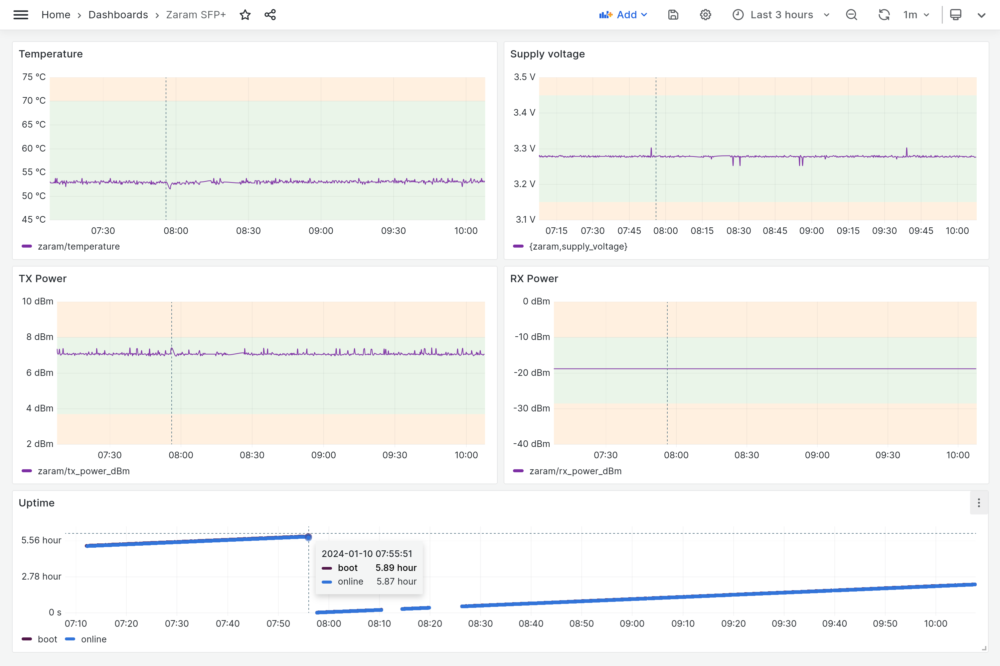

zaram2mqtt
===
This is a python script to poke the Zaram XGSPON SFP+ ONT (`ZXOS11NPI`) via SSH and get some values out of it and publish those on MQTT. This may allow you to do some logging and graphing and such.

```shell
$ mqtt-simple -h mqtt.peetz0r.nl -s 'zaram/#'
zaram/diagnostic_monitoring_type 0x68
zaram/calibration internal
zaram/power_measurement_type average
zaram/SFF-8472_compliant True
zaram/temperature 53.000
zaram/supply_voltage 3.276
zaram/tx_bias_current 17.408
zaram/tx_power_mw 4.989
zaram/tx_power_dBm 6.980
zaram/rx_power_mw 0.013
zaram/rx_power_dBm -18.794
zaram/uptime/boot 7236
zaram/uptime/online 7198
```

Here's an example of what you can make with it. You'll have to DIY your own since everything depends on your Grafana datasource. Or maybe you don't want to use Grafana at all.


